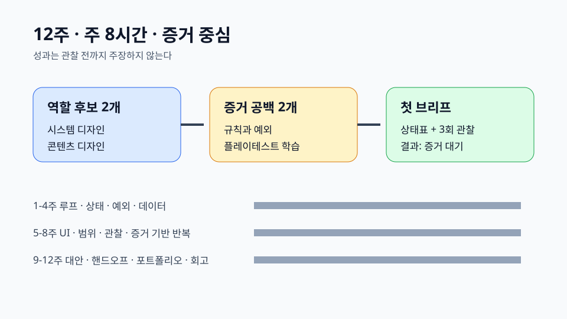

# 입문 게임 디자이너 12주 로드맵 {#career-roadmap}

## 범위 {#scope}

12주 동안 **주 8시간**을 사용하며 작은 솔로 프로토타입으로 증거를 만든다. 현재 관심은 숙련 증거가 아니다.

## 역할 후보 2개 {#roles}

- 시스템 디자인: 명시적 규칙, 예외, 데이터 표, 플레이테스트 증거가 필요하다.
- 콘텐츠 디자인: 반복 가능한 콘텐츠 구조, 페이싱 판단, 제작 가능한 핸드오프가 필요하다.

## 증거 공백 {#gaps}

규칙·예외 공백은 실패와 회복을 포함한 유한 상태 규칙표로 다룬다. 플레이테스트 학습 공백은 세 번의 관찰 세션과 증거에 따라 바뀐 결정을 기록해 다룬다.

## 12주 실행 리듬 {#roadmap}

1-4주는 루프·상태·예외·데이터, 5-8주는 UI 피드백·범위·관찰·증거 기반 반복, 9-12주는 대안 비교·핸드오프·포트폴리오·회고에 집중한다.

## 첫 포트폴리오 브리프 {#portfolio}

한 자원만 사용하고 자동 회복과 사용자 유발 회복을 비교한다. 상태표 수용 기준과 세 번의 관찰 세션으로 검증한다. **결과는 증거 대기이며, 세션 전에 성과를 주장하지 않는다.**

## 근거 포인터 {#sources}

- `request.json#/availableHoursPerWeek`
- `result.json#/roleCandidates`
- `result.json#/evidenceGaps`
- `result.json#/weeks`
- `result.json#/firstPortfolioBrief`
