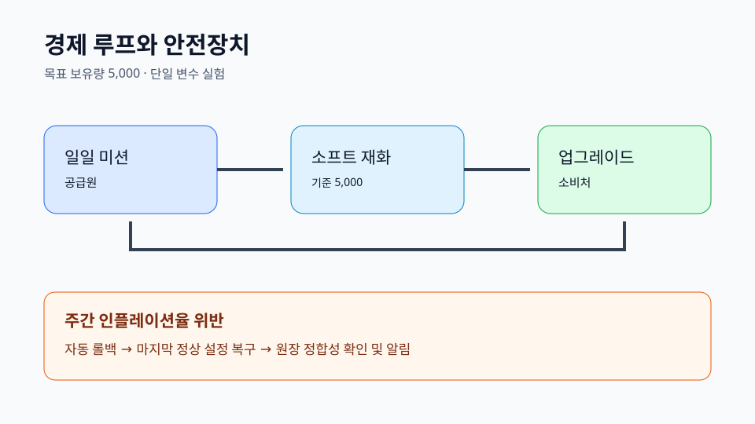

# 라이브 서비스 RPG 경제 운영 브리프 {#studio-economy-brief}

## 운영 판단 {#decision-summary}

일일 미션에서 소프트 재화를 공급하고 업그레이드에서 소비한다. 운영 기준인 **목표 보유량 5,000**을 중심으로 주간 공급-소비 차이를 관찰한다.

## 경제 루프 {#economy-loop}

- 공급원: 일일 미션
- 자원: 소프트 재화
- 소비처: 업그레이드
- 실물 가격 정책: 숨김 환산 없음
- 확률 정책: 확률 공개

## 단일 변수 실험 {#experiment}

가설은 제한된 공급 조정이 인플레이션 없이 진행을 개선한다는 것이다. 대조군은 현재 지급률이며, 바꾸는 값은 일일 미션 지급량 하나뿐이다. **주간 인플레이션율**이 가드레일이고, 위반하면 실험을 중단한다.

## 자동 롤백 {#rollback}

가드레일 위반 시 마지막 정상 설정으로 자동 복구한다. 책임자는 라이브 운영 오너이며, 복구 후 원장을 정합화하고 알린다.

## 근거 포인터 {#sources}

- `result.json#/domain/economy`
- `result.json#/domain/experiment`
- `result.json#/domain/rollback`
- `approval-snapshot.json#/responsibleGates`
